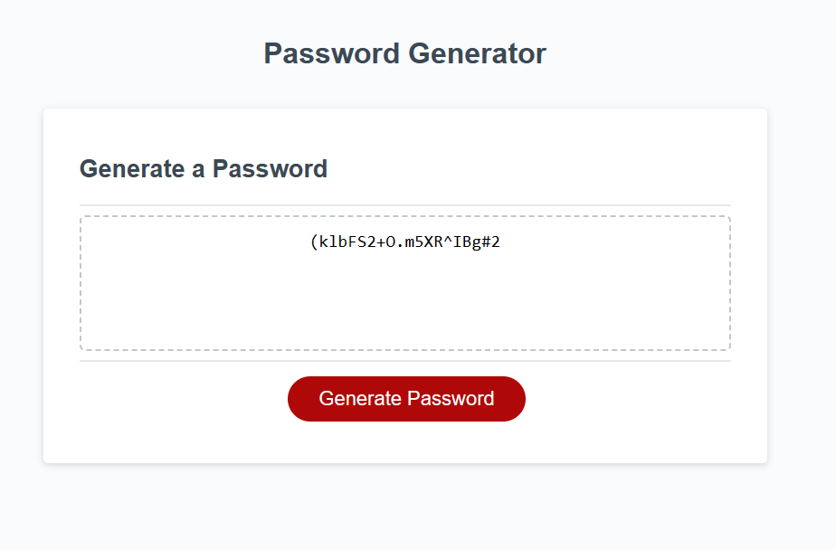

# Password-Generator
A simple web application that generates a random password based on user-selected criteria. The application runs in the browser and features a clean and polished user interface, adapting to multiple screen sizes.

## Table of Contents
- [Overview](#overview)
- [Instructions](#instructions)
- [Demo](#demo)
- [Technologies](#technologies)

## Overview

This project is a password generator application that allows users to customize the password based on specific criteria, such as length and character types. The generated password is displayed on the page or in an alert.

## Instructions

To use the password generator:

1. Open the [Password Generator](#) application in your web browser.
2. Click the "Generate Password" button.
3. Follow the prompts to specify the desired password length and character types.
4. Click "OK" or "Cancel" based on your preference for including lowercase, uppercase, numeric, and special characters.
5. The generated password will be displayed in the designated area on the page.

### Demo 

Screenshoot 

#### Technologies 
HTML
CSS
JavaScript

